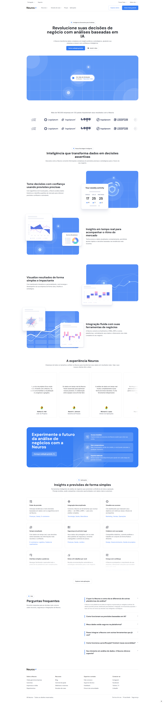
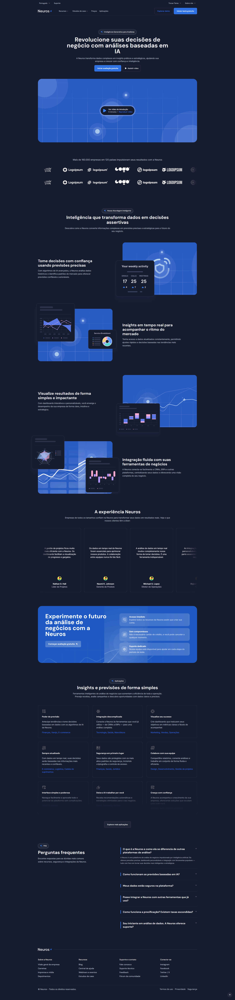

#  Datawise — Landing Page

Uma landing page moderna e responsiva desenvolvida com **Next.js**, **Tailwind CSS** e **ShadCN UI**, baseada em um design Figma [Khoa (JAK)](https://www.figma.com/community/file/1297441219263679519/saas-landing-page-template-neuros-lite-ai-powerd-product).  
Inclui suporte a **modo claro/escuro**, **internacionalização (pt/en)** e **animações sutis** para uma experiência fluida.

---

## 🖥️ Preview

🔗 **Live Demo:** [Neuros](https://neuros-landing-page.vercel.app)

ou veja abaixo algumas capturas de tela:

| Tema Claro                                          | Tema Escuro                                       |
| --------------------------------------------------- | ------------------------------------------------- |
|  |  |

---

## ✨ Features

- 🌍 Suporte a múltiplos idiomas (Português e Inglês) com **next-intl**
- 🌓 Troca de tema (claro, escuro ou sistema)
- 📱 Layout totalmente responsivo
- 🎨 Estilo com **Tailwind CSS** + **ShadCN UI**
- ⚡️ Performance otimizada com **Next.js 15+**
- ✨ Animações fluidas e lineares

---

## 🛠️ Tecnologias

- [Next.js](https://nextjs.org/)
- [TypeScript](https://www.typescriptlang.org/)
- [Tailwind CSS](https://tailwindcss.com/)
- [ShadCN UI](https://ui.shadcn.com/)
- [next-intl](https://next-intl-docs.vercel.app/)

---

## 🚀 Como Rodar Localmente

### Pré-requisitos

- Node.js (LTS)
- npm, yarn ou pnpm

### Instalação

1.  **Clone:**
    ```bash
    git clone git@github.com:gustavoppdev/neuros-landing-page.git
    cd neuros-landing-page
    ```
2.  **Dependências:**
    ```bash
    npm install
    ```
3.  **Executar:**
    ```bash
    npm run dev
    ```
    Acesse: `http://localhost:3000`

---

## 🤝 Créditos

- **Design Original:** [Khoa (JAK)](https://www.figma.com/community/file/1297441219263679519/saas-landing-page-template-neuros-lite-ai-powerd-product)